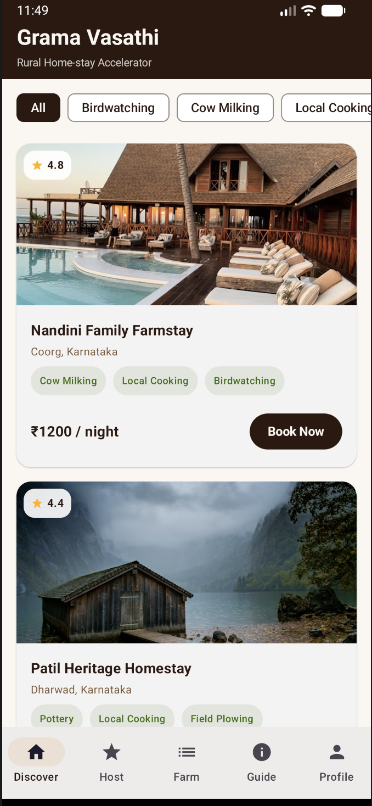
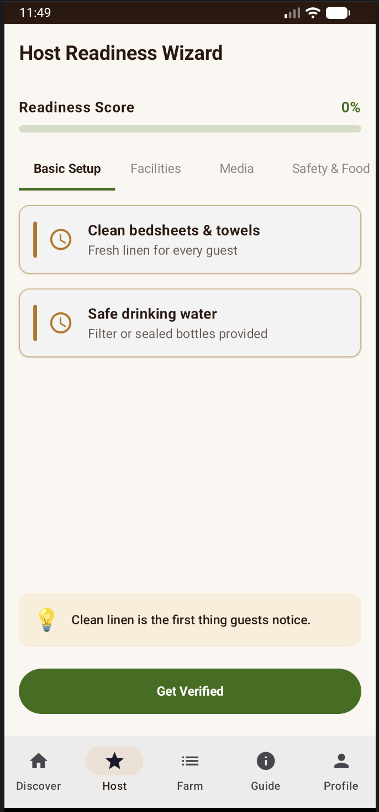
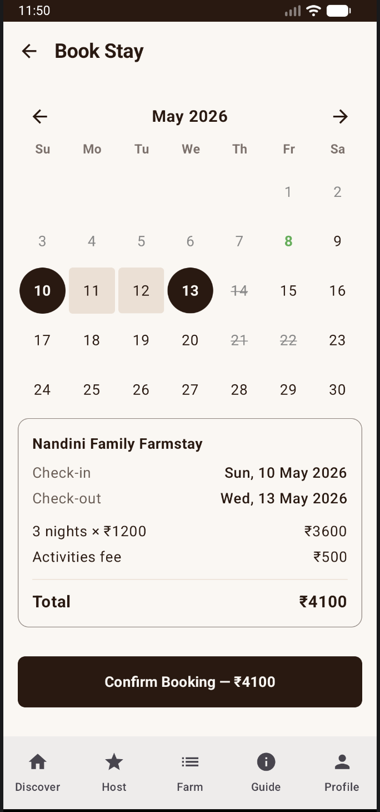
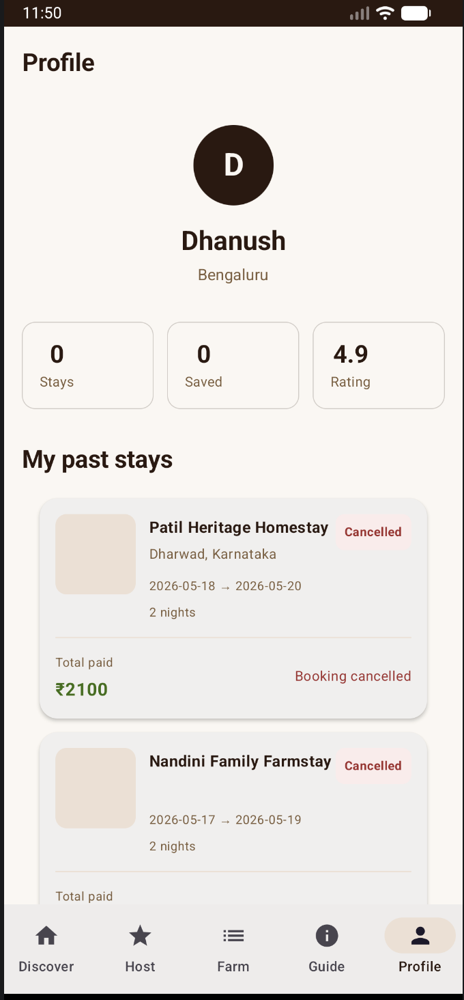

# Grama Vasathi

Rural homestay discovery and host readiness for Karnataka — *Rural Home-stay Accelerator* · *Matti-Vasane (Scent of the Soil)*.

---

## Problem statement

Many travelers want **authentic rural stays** (farm experiences, local culture, verified hygiene) but lack a single, trustworthy way to **discover, compare, and book** homestays. Hosts, in turn, need a **simple checklist** to prepare listings and operations before welcoming guests. This app addresses both sides: a **guest** flow for browsing, searching, and booking Firestore-backed stays, and a **host** flow focused on **readiness** (wizard checklist) separate from guest discovery — with **Firebase Auth**, persisted sessions, and optional demo accounts for onboarding and QA.

---

## Features

| Area | What the app does |
|------|-------------------|
| **Auth** | Splash → **Welcome** (Guest vs Host) → email/password login or sign-up; Firebase session persists until sign out; **AuthNavigationGate** blocks protected routes when signed out. |
| **Guest** | **Discover** — browse `stays`, activity filters (via **Farm**), search, stay detail, **booking** with dates and Firestore `bookings`, success screen; **Culture** guide; **Profile** — stats, live past bookings, cancel booking, switch to host. |
| **Host** | **Readiness** — multi-step **Host Wizard** (basic setup, facilities, media, safety/food, pricing) with checklist state in Firestore; **Profile** — switch to guest; bottom nav: Readiness · Profile. |
| **Data** | Firestore `stays`, `bookings`, `guests`, host wizard progress; **auto-seed** four Karnataka farmstays when `stays` is empty (stable IDs e.g. `stay_patil_dharwad`); **DataStore** remembers guest vs host UI mode. |
| **UX** | Material 3 (cream/brown theme), adaptive launcher icon, Android 12+ **SplashScreen** API, Coil images, Hilt DI, Navigation Compose. |
| **Demo** | “Fill demo credentials” on login; demo emails can **auto-register** on first sign-in (`DemoCredentials` + `AuthViewModel`). |

---

## Tech stack

| Layer | Technology |
|--------|------------|
| Language | Kotlin |
| UI | Jetpack Compose, Material 3 |
| DI | Hilt (Dagger) |
| Concurrency | Coroutines, Flow |
| Backend | Firebase Authentication, Cloud Firestore |
| Images | Coil |
| Local state | DataStore Preferences |
| Build | Gradle (Kotlin DSL), Android Gradle Plugin 8.x |

---

## Installation

1. **Prerequisites**
   - [Android Studio](https://developer.android.com/studio) (Hedgehog or newer recommended).
   - **JDK 17** (match your Studio / AGP requirements).
   - **Android SDK** with API **34** installed (`compileSdk` / `targetSdk` 34; `minSdk` 26).

2. **Clone the repository**
   ```bash
   git clone <your-repo-url>
   cd grama-vasthi
   ```

3. **Firebase**
   - Create a [Firebase](https://console.firebase.google.com) project.
   - Add an Android app with package **`com.example.gramavasathi`** (or align `applicationId` in `app/build.gradle.kts` with your Firebase app).
   - Download **`google-services.json`** into the **`app/`** module (next to `app/build.gradle.kts`).
   - Enable **Authentication → Sign-in method → Email/Password**.
   - Create a **Cloud Firestore** database and set **security rules** appropriate for production before launch.

4. **Local SDK path**
   - Open the project in Android Studio; it creates **`local.properties`** with `sdk.dir`. This file is **gitignored** — do not commit it.

5. **Sync Gradle**  
   Use **File → Sync Project with Gradle Files** in Android Studio, or rely on the first Gradle command below.

---

## Run

**Debug APK (CLI):**
```bash
./gradlew :app:assembleDebug
```
Output: `app/build/outputs/apk/debug/app-debug.apk`

**Run on a device or emulator (CLI):**
```bash
./gradlew :app:installDebug
```

**From Android Studio:** select a device/emulator → **Run** ▶ (green play) on the `app` configuration.

---

# 📱 Screenshots

| Home Screen | Host Readiness |
|---|---|
|  |  |

| Booking Screen | Profile Screen |
|---|---|
|  |  |

---


## Folder structure

```
grama-vasthi/
├── app/
│   ├── build.gradle.kts
│   ├── google-services.json          # from Firebase (do not commit secrets loosely; restrict API keys)
│   └── src/main/
│       ├── AndroidManifest.xml
│       ├── java/com/example/gramavasathi/
│       │   ├── MainActivity.kt
│       │   ├── GramaVasathiApp.kt
│       │   ├── data/                 # repositories, preferences, seeding
│       │   ├── domain/               # models, repository interfaces
│       │   ├── di/                   # Hilt modules
│       │   ├── navigation/           # NavHost, screens, bottom bar, auth gate
│       │   ├── demo/                 # DemoCredentials
│       │   ├── ui/screens/           # Compose UI
│       │   ├── ui/theme/
│       │   └── viewmodel/
│       └── res/                      # themes, drawables, mipmaps, xml
├── gradle/wrapper/
├── build.gradle.kts
├── settings.gradle.kts
├── gradle.properties
├── gradlew / gradlew.bat
├── README.md
└── .gitignore
```

---

## Future improvements

- **Firestore security rules** — tighten read/write rules for `stays`, `bookings`, `guests`, and host wizard documents; add server-side validation or Cloud Functions for sensitive writes.
- **Search** — integrate Algolia or Firestore extensions for full-text search at scale instead of client-side filtering.
- **Payments** — connect a real payment gateway; today booking is Firestore-centric without PSP integration.
- **Push notifications** — booking confirmations, host reminders (FCM).
- **Maps & directions** — link stays to Maps; filter by distance.
- **Google Sign-In** — `play-services-auth` is already a dependency; wire optional social login.
- **Release pipeline** — minify/R8, ProGuard rules for Hilt/Firebase, Play App Signing, internal → closed → open testing tracks.
- **Product** — host dashboard for managing listings and availability beyond the readiness wizard.

---


